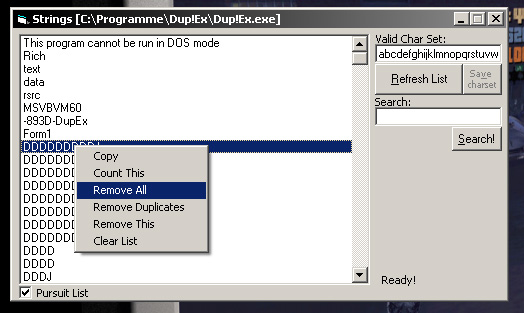



## a StringExtractor \- Extracts Strings from binary Files

### Description

a StringExtractor - Extracts Strings from binary Files.

StringExtractor

----

Author: CodeXP

Contact: CodeXP@Lycos.de

Description:

This App extracts Strings from binary files (like .EXE).

You can search certain Strings that were found in binary file.

(for example you can search some cheats in a game file,

for what I also wrote it. Actually for own use :)

How to use:

drag'n'drop a file, that you would search for Strings,

on the StringExtractor EXEcutable
 
### More Info
 

             |
---                |---
**Submitted On**   |2003-12-22 03:32:44
**By**             |[CodeXP](https://github.com/Planet-Source-Code/PSCIndex/blob/master/ByAuthor/codexp.md)
**Level**          |Advanced
**User Rating**    |4.3 (17 globes from 4 users)
**Compatibility**  |VB 4\.0 \(32\-bit\), VB 5\.0, VB 6\.0
**Category**       |[Files/ File Controls/ Input/ Output](https://github.com/Planet-Source-Code/PSCIndex/blob/master/ByCategory/files-file-controls-input-output__1-3.md)
**World**          |[Visual Basic](https://github.com/Planet-Source-Code/PSCIndex/blob/master/ByWorld/visual-basic.md)
**Archive File**   |[a\_StringEx1692761112004\.zip](https://github.com/Planet-Source-Code/codexp-a-stringextractor-extracts-strings-from-binary-files__1-50917/archive/master.zip)

